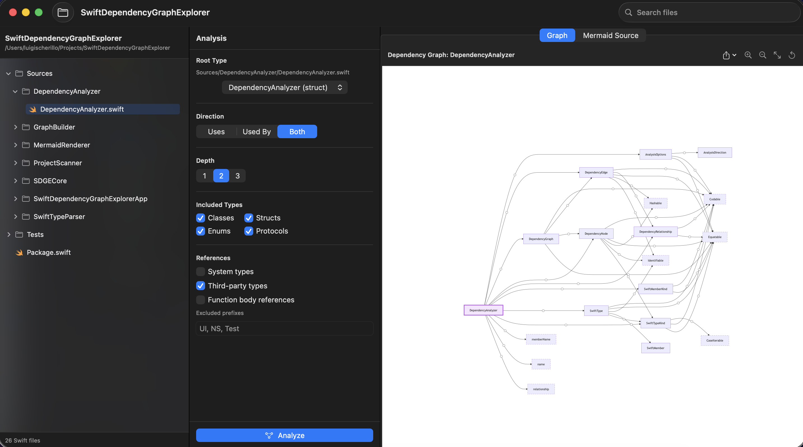

# Swift Dependency Graph Explorer

Swift Dependency Graph Explorer is a macOS SwiftUI app for exploring type-level dependencies in a local Swift project. Choose a project folder, select a type, configure the analysis, and inspect or export the resulting Mermaid dependency graph.

All scanning, parsing, analysis, rendering, and export work happens locally on your Mac. The app does not send source code to a service.

## Screenshot



## Development Setup

Requirements:

- macOS 13 or later
- Xcode 15 or later, including its Swift toolchain

The Mermaid JavaScript runtime is vendored in the repository for local rendering. The Swift parser depends on [swift-syntax](https://github.com/swiftlang/swift-syntax), resolved automatically by Swift Package Manager — the first build needs network access to fetch it.

To run the app:

1. Open `Package.swift` in Xcode (double-click it, or run `open Package.swift`) — Xcode resolves the package and opens it as a project.
2. In the scheme selector, choose the `SwiftDependencyGraphExplorer` executable scheme (the app target, not one of the library targets).
3. Press Run (⌘R).

You can also build, test, and run from the command line with Swift Package Manager:

```sh
swift build
swift test
swift run SwiftDependencyGraphExplorer
```

In the app, choose a Swift project folder, select a source file and root type, adjust the graph options, then select **Analyze**. Graphs can be exported as Mermaid source (`.mmd`) or SVG (`.svg`).

## Command-Line Tool

The same scan/parse/analyze pipeline is also available as `sdge`, a standalone CLI — useful for scripting, CI, or piping a project's dependency graph to another tool (including feeding it to an AI agent as structured input).

```sh
# Discover the types in a project (to find a value for --root-type)
swift run sdge list-types --path /path/to/project

# Build a dependency graph, same options as the app's Analysis panel
swift run sdge analyze --path /path/to/project --root-type AccountViewModel \
  --depth 2 --direction both --format mermaid

# Or as machine-readable JSON, written to a file
swift run sdge analyze --path /path/to/project --root-type AccountViewModel \
  --format json --output graph.json
```

Run `swift run sdge --help` or `swift run sdge analyze --help` for the full option list (system/third-party type filters, kind filters, excluded prefixes, etc. — they mirror `AnalysisOptions`). `--format` accepts `mermaid`, `dot`, or `json`; `list-types --format json` is available too.

## Example Mermaid Output


## Known Limitations

- The app parses Swift source with [SwiftSyntax](https://github.com/swiftlang/swift-syntax) (the same parser the Swift compiler uses), so declaration, scope, and member boundaries are accurate. It does not run full semantic type checking, though, so dependency names are still resolved by matching identifiers rather than by cross-module type resolution.
- It analyzes Swift source files only and intentionally skips hidden folders, package descendants, and common generated or dependency directories such as `.build`, `Pods`, `Carthage`, and `node_modules`.
- Dependency resolution is based on names rather than full module-aware type resolution; system and third-party references can be filtered but may be classified conservatively.
- The Swift package targets macOS 13 or later.

## License

This project is licensed under the MIT License. See [LICENSE](LICENSE) for the full text. Mermaid is distributed under its own MIT license; see [THIRD_PARTY_NOTICES.md](THIRD_PARTY_NOTICES.md).
